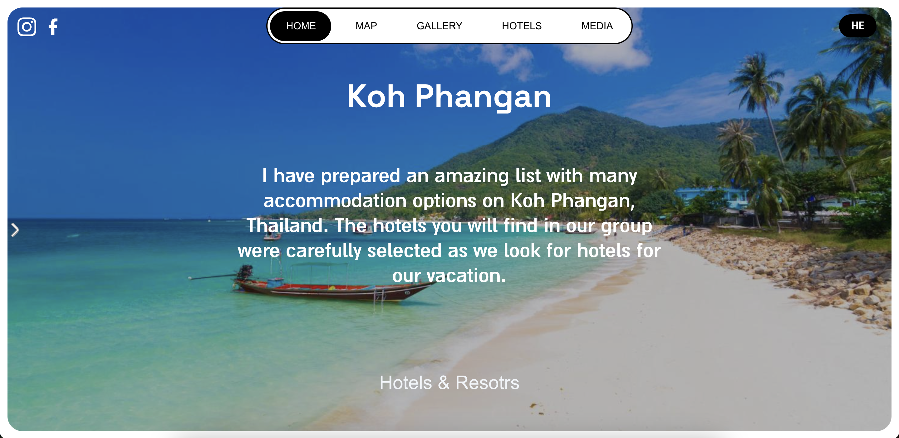

# 🌴 ThaiIslands – UX-Oriented Destination Guide for Thai Islands

A **full-stack**, multi-language web application built with **Next.js**, designed from scratch with a strong focus on **UX/UI, modular architecture, and clean code**. The app provides an engaging and informative experience for users planning a trip to Thailand's top islands: **Koh Phangan**, **Koh Samui**, and **Koh Tao**.

## 📸 Preview



**Live site:** [https://thaiislands.vercel.app](https://thaiislands.vercel.app)  
**Code:** [GitHub Repository](https://github.com/GNGscr/Thaiislands)

---

## 🧑‍💻 Author

Created by **Daniel Erlich**, a **Full Stack Developer** with a strong orientation toward frontend and user experience (70% Frontend / 30% Backend).  
Responsible for **ideation, design, development, and deployment** — end to end.

---

## 🚀 Features

- **Multi-page UX-focused app** with smooth scroll, navigation, and rich visuals
- **Dynamic content** per island using `slug`-based routing (`/koh-phangan`, `/koh-samui`, `/koh-tao`)
- **Live MongoDB integration** via Mongoose + Next.js API routes
- **Language toggle (Hebrew/English)** with direction-aware layouts (LTR/RTL)
- **Context API** used for global state management (language, filters)
- **Framer Motion animations**: microinteractions, staggered transitions, carousels
- **Responsive design**: fully adapted for mobile/tablet/desktop
- **Interactive side navigation**, filtering, and hover effects
- **Accessible foundation**: structured markup with semantic elements and progressive enhancement
- **Deployed on Vercel**

---

## 🧱 Tech Stack

| Layer       | Technology                         |
|------------|-------------------------------------|
| Frontend   | React 18, Next.js, Framer Motion    |
| Backend    | MongoDB Atlas, Mongoose             |
| Styling    | Tailwind CSS + CSS Modules          |
| State      | React Context API                   |
| Deployment | Vercel                              |
| Assets     | Optimized images, lazy loading      |
| Animation  | Framer Motion                       |
| i18n       | Built-in language support (HE/EN)   |

---

## 📁 Project Structure

```bash

Thaiislands/
├── public/              # Static assets (images, favicon)
├── src/
│   ├── components/      # Modular UI components
│   ├── data/            # Island-specific content
│   ├── hooks/           # Custom React hooks
│   ├── layout/          # Page layout structure
│   ├── pages/           # Next.js routes
│   └── styles/          # CSS modules and global styles
├── .env.local           # Environment variables
└── package.json         # Dependencies and scripts

```

---


## 🛠️ Installation & Running Locally
## Requires: Node.js 18+, npm or yarn, and a MongoDB Atlas connection

## Clone the repo

```bash

git clone https://github.com/GNGscr/Thaiislands.git
cd Thaiislands
Install dependencies


npm install
# or
yarn install
Configure environment variables
Create a .env.local file at the root with your MongoDB URI:

```

---

## Connect to MongoDB


```bash
MONGODB_URI=your-mongodb-connection-string
```

---


## Run the dev server

```bash
npm run dev
# or
yarn dev
The app will run on http://localhost:3000.
```

---


## ✅ Pages Overview
## Route	Description
/	Landing page with intro + link to islands
/koh-phangan	Island overview with hero, gallery, and hotels
/koh-samui	Island page with alternate content
/koh-tao	Similar structure, tailored for Koh Tao
/about	Background and trip explanation

## Each page pulls data live from MongoDB, rendered dynamically via SSR/ISR.


---


## 🧠 Key Architectural Choices

No Redux or Zustand: All state management is handled via URL params + Context API to minimize overhead and encourage stateless behavior.

Accessible-first: All interactive elements are progressively enhanced and aim to support keyboard use (some work remains).

Design-led development: UX wireframes and visual structure defined before code, ensuring consistency.

Component reusability: Typography, buttons, and layouts extracted and reused across pages.


---


## 🌍 Languages & Directionality

Supports Hebrew and English with dir="rtl"/ltr rendering

Text, layouts, and animations adapt to language choice

Toggle available in top-right menu


---


## 💡 Possible Improvements (Not included in current version)

Lighthouse score optimization (accessibility, performance)

Tests with Jest or Cypress

Improved skeleton loading during SSR

Meta tags (OG, SEO per page)
