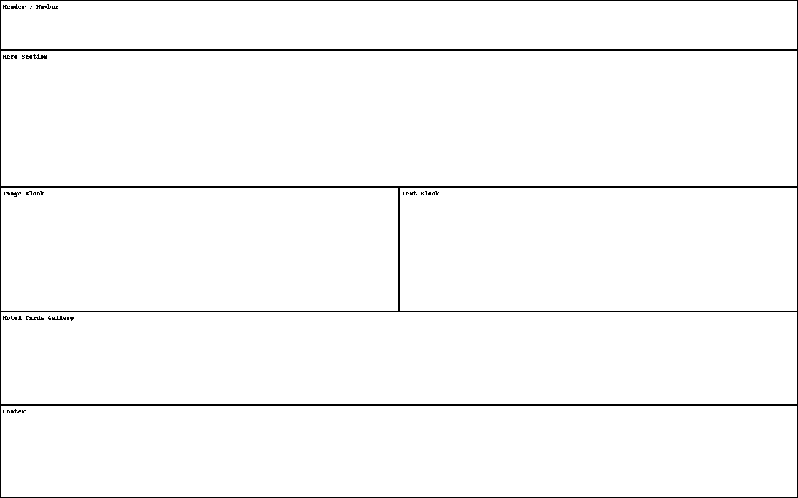
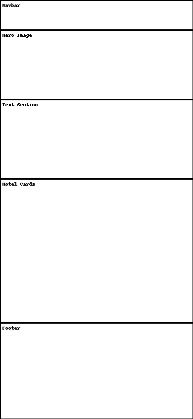

## 📐 UX Approach & Design Process

As stated this project was planned and designed with a **UX-first mindset** — focusing on content hierarchy, clarity, and flow before starting development.

**Planning highlights:**

- 🧭 User flow mapped to mimic the experience of discovering and comparing islands

- ✍️ Wireframes created for both desktop and mobile to visualize structure and layout before styling

- 🎯 Focus on clarity & ease-of-use: Clear navigation, large touch targets, and consistent spacing

- 🕹️ Interactive behavior defined early: Hotel flip cards, scroll-based icon color transitions, filtering

- 📱 Mobile-first design principles applied from the start

- **Wireframes:**

    - 

    - 

**These early sketches as mentioned guided the visual structure, UX decisions, and component breakdown used in the final app.**